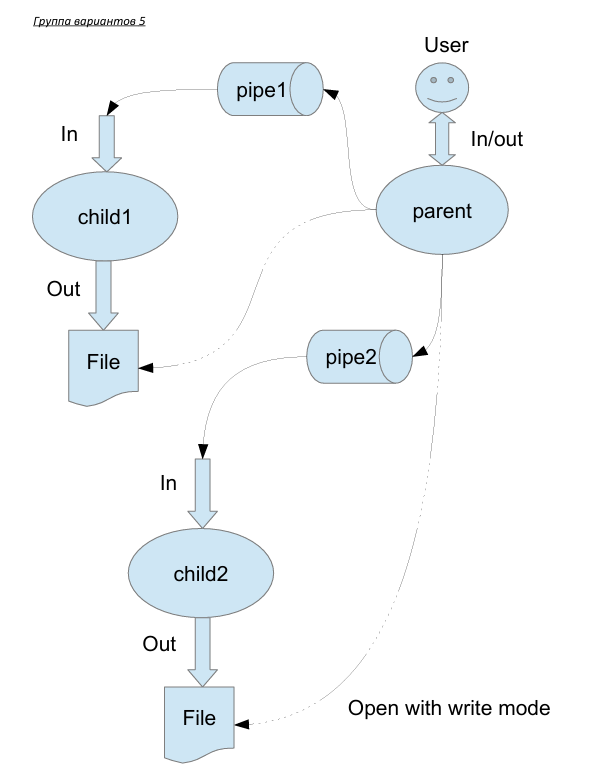

# Лабораторная работа №1
### Выполнил Салихов Руслан М8О-203Б-23
 * Вариант 19) Правило фильтрации: с вероятностью 80% строки отправляются в pipe1, иначе в pipe2. 
Дочерние процессы удаляют все гласные из строк.

